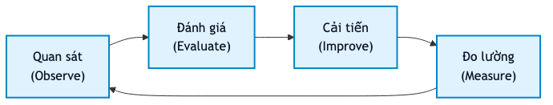
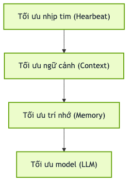

<!--markpress-opt
{
  "autoSplit": false,
  "sanitize": false,
  "title": "Tối ưu hóa OpenClaw"
}
markpress-opt-->

<!--slide-attr x=0 y=0 scale=1.2 -->

# Tối ưu hóa OpenClaw
## Bí quyết giúp AI Agent Rẻ hơn, Nhanh hơn và Thông minh hơn

Bằng cách thay đổi cấu hình `openclaw.json`

<!-- SPEAKER NOTES
- Giới thiệu bản thân:
  - Tên / Tuổi
  - Vị trí: Technical Leader, thành viên của Câu lạc bộ Codegym Alumni

- Giới thiệu chủ đề: Tối ưu hóa OpenClaw
-->

------

<!--slide-attr x=2000 y=-150 rotate=-2 scale=1.0 -->

# Vấn đề của Agent: "Nghiện" tiêu tiền

- Cứ mỗi tin nhắn mới, hệ thống lại **gửi lại toàn bộ các tin nhắn trước đó**
- Tính năng tự động chạy theo chu kì (background periodic check) tự động kích hoạt **mỗi 30 phút một lần**
- Các file trong không gian làm việc (workspace) bị tải lại **ở mỗi lượt chat**

> Các cấu hình mặc định của OpenClaw nhằm đảm bảo hoạt động tốt trong điều kiện lý tưởng về mặt chi phí

<!-- SPEAKER NOTES
- Tương tác với khán giả:
  - Ở đây đã ai dùng OpenClaw tháng hết trên 5 triệu chưa ?

- Đây không phải là lỗi của OpenClaw, đây là tính năng mặc định
- Tin vui là có thể cải thiện được
- Mình tới đây là để nói về việc đó

-->

------

<!--slide-attr x=4000 y=150 rotate=2 scale=1.0 -->

# Con số thực tế: Chi phí là bao nhiêu?

> **Chi phí** = **Số lượng token** x **Đơn giá Model**

| Mô hình (Model) | Chi phí ước tính hàng tháng |
|---|---|
| Claude Opus 4.6 | ~325 USD / tháng |
| Claude Sonnet 4.6 | ~188 USD / tháng |
| Gemini 2.5 Flash | ~24 USD / tháng |
| GPT-OSS-120B | ~2 USD / tháng |

**Phần lớn số tiền đó là chi phí vận hành thừa thãi, chứ không phải chi phí xử lý công việc thực tế.**

<!-- SPEAKER NOTES
- Nhắc rõ: Chi phí = Số lượng token x Đơn giá Model

- Để giảm được chi phí, cần giảm hoặc số lượng token, hoặc đơn giá model, hoặc cả 2

- Con số trên được ước tính dựa trên dữ liệu thực tế của các hệ thống OpenClaw đang chạy, số liệu có thể nhiều hơn

- Có thể tối ưu khoản chi phí này mà không giảm chất lượng đầu ra của model
-->

------

<!--slide-attr x=6000 y=-100 rotate=-1 scale=1.1 -->

# Làm chủ `openclaw.json`

> Thay đổi các giá trị mặc định trong file này có thể **Cắt giảm 60–80% chi phí.**.

```json
{
  "agents": {
    "defaults": {
      "..."
    }
  }
}
```

<!-- SPEAKER NOTES
- Có nhiều cách tối ưu khác nhau, nhưng buổi chia sẻ này chỉ tập trung vào cấu hình openclaw.json

- Không cần phải sửa code OpenClaw, chỉ cần sửa cấu hình openclaw và khởi động lại

- Mình sẽ chia các cấu hình tối ưu thành 4 nhóm chính, gồm các cấu hình cụ thể
-->

------

<!--slide-attr x=6000 y=1800 rotate=3 scale=1.0 -->

# Tối ưu ngữ cảnh

> AI sẽ được "nhồi" những gì vào bộ nhớ ở mỗi lượt giao task?

Mỗi ký tự trong ngữ cảnh của bạn làm tăng số lượng tokens.

Các thiết lập sau đây giúp bạn kiểm soát **dung lượng của ngữ cảnh đó**.

<!-- SPEAKER NOTES
- Như đã nói ở phần chi phí, phần này tập trung vào giảm số lượng token

- Những gì AI đọc được, là số lượng token gửi đến cho model

- Giảm được phần này, nghĩa là giảm được chi phí

-->

------

<!--slide-attr x=4000 y=1650 rotate=-2 scale=1.0 -->

# Hạn chế lặp ngữ cảnh

> Mặc định các ngữ cảnh cũ sẽ bị lặp lại với mỗi lần giao task

```json
{
  "contextInjection": "continuation-skip",
  "bootstrapMaxChars": 12000,
  "bootstrapTotalMaxChars": 60000
}
```

Trong một phiên chat 20 lượt: lượt thứ 18 sẽ không nạp lại ngữ cảnh giống nhau.

[agents.defaults.contextInjection](https://docs.openclaw.ai/gateway/config-agents#agents-defaults-contextinjection)

<!-- SPEAKER NOTES
- Trường hợp thực tế khi giao việc, phải gửi nhiều thông tin cho nhân viên để có thể làm việc được 

- Với openclaw, mặc định những thông tin này bị nhắc đi nhắc lại 

- contextInjection kiểm soát thời điểm các file bootstrap của workspace (SOUL.md, AGENTS.md và các file tương tự) được nạp vào system prompt.

- Giá trị mặc định là "always", nghĩa là mỗi lượt tiếp theo đều phải trả toàn bộ chi phí token bootstrap.

- Giá trị "continuation-skip" chỉ thêm thông tin mới vào ngữ cảnh, không thêm toàn bộ từ đầu

- Hữu ích với file AGENTS.md lớn, file này không bị load lại ở mỗi lần gửi prompt

- Tác động: trong một cuộc trò chuyện 20 lượt thông thường với 10.000 token workspace, bạn loại bỏ được việc nạp lại trong khoảng 18 trong số 20 lượt đó.
-->

------

<!--slide-attr x=2000 y=1950 rotate=2 scale=1.0 -->

# Dọn dẹp kết quả chạy tool

> Tool đã chạy xong thì không nên giữ kết quả lại quá lâu

```json
{
  "contextPruning": {
    "mode": "cache-ttl",
    "ttl": "1h"
  }
}
```

Loại bỏ đầu ra, đầu vào của các công cụ đã chạy trước đó, giúp giảm những tokens thừa thãi trong ngữ cảnh.

[agents.defaults.contextPruning](https://docs.openclaw.ai/gateway/config-agents#agents-defaults-contextpruning)

<!-- SPEAKER NOTES
- Giống với thực tế, khi con người (chúng ta) chạy lệnh, chạy xong chúng ta sẽ tắt terminal hoặc xóa các dòng lệnh cũ

- Khi agent đọc một file, duyệt web, hay chạy lệnh shell, toàn bộ kết quả đó được lưu vào lịch sử cuộc trò chuyện.

- Sau một lúc, đặc biệt trong các phiên làm việc dài, những kết quả đó đã lỗi thời. Bạn đã xử lý chúng xong rồi. Nhưng chúng vẫn chiếm chỗ trong ngữ cảnh.

- contextPruning xóa chúng khỏi ngữ cảnh gửi đến cho model, các thông tin vẫn nằm ở lịch sử phiên làm việc

- Với TTL là 1h, bất kỳ kết quả tool nào cũ hơn một tiếng sẽ được dọn dẹp tự động.
-->

------

<!--slide-attr x=0 y=1800 rotate=-3 scale=1.0 -->

# Tối ưu trí nhớ

> Agent sẽ nhớ được những gì giữa các phiên làm việc?

**Không có trí nhớ tốt:** 
- AI quên mất những gì đã được dạy khi bắt đầu làm việc.
- AI phải nghiên cứu lại, thử sai nhiều, làm tăng số lượng token và số lần request

**Có trí nhớ tốt:**
- AI sẽ nhớ lại những thứ được dạy trước khi bắt đầu làm việc.

<!-- SPEAKER NOTES
- Nhóm này giúp giảm những token mang tính suy luận lại những kiến thức đã biết

- Nhóm này giúp giảm những token khi AI phải suy đoán để thực hiện công việc

- Nhóm này tập trung vào việc đảm bảo những điều quan trọng được lưu giữ đúng cách.

- Nhóm này đồng thời khiến AI gợi nhớ thông minh hơn và chỉ nhớ lại những thông tin thực sự cần.
-->

------

<!--slide-attr x=0 y=3600 rotate=2 scale=1.0 -->

# Ghi nhớ khi cửa sổ ngữ cảnh sắp đầy

> Ghi nhớ những thông tin quan trọng trước khi tóm tắt ngữ cảnh hiện tại

```json
{
  "compaction": {
    "memoryFlush": {
      "enabled": true,
      "model": "ollama/qwen3:8b",
      "prompt": "Write lasting notes to memory/YYYY-MM-DD.md. Reply NO_REPLY if nothing to store."
    }
  }
}
```

Ghi nhớ mỗi khi tóm tắt, nên sử dụng **mô hình miễn phí**, để giảm thiểu chi phí tới mức thấp nhất.

[compaction.memoryFlush](https://docs.openclaw.ai/concepts/compaction#memory-flush)

<!-- SPEAKER NOTES
- Vấn đề: các chi tiết quan trọng có thể bị mất trong quá trình tóm tắt. 

- Ví dụ: Những quyết định quan trọng, các task đang mở, trạng thái dự án hiện tại.

- Cài đặt này giúp lưu lại thông tin quan trọng trước khi bị tóm tắt
-->

------

<!--slide-attr x=2000 y=3450 rotate=-2 scale=1.0 -->

# Gợi nhớ lại theo ngôn ngữ tự nhiên

> Sự khác biệt giữa việc bấm `Ctrl+F` tìm từ khóa và tìm bằng ngôn ngữ tự nhiên.

```json
{
  "memorySearch": {
    "provider": "openai"
  }
}
```

Kích hoạt **tìm kiếm kết hợp (hybrid search)**: khớp từ khóa + tìm kiếm ngữ nghĩa (vector similarity).

Cho phép tìm kiếm bằng ngôn ngữ tự nhiên, giúp AI truy xuất thông tin chính xác hơn.

[agents.defaults.memorySearch](https://docs.openclaw.ai/concepts/memory-search)

<!-- SPEAKER NOTES
- Trước thời đại AI, chúng ta tìm kiếm bằng từ khóa. 

- Sau thời đại AI, chúng ta tìm kiếm bằng ngôn ngữ tự nhiên

- AI cũng vậy, tìm kiếm bằng ngôn ngữ tự nhiên sẽ cho kết quả tốt hơn là chỉ tìm kiếm bằng từ khóa thông thường

- OpenClaw có một engine bộ nhớ SQLite tích hợp. Mặc định nó dùng FTS5, nhưng bản chất vẫn là tìm kiếm từ khóa

- Ví dụ thực tế: bạn đã lưu ghi chú về "giới hạn tần suất API" ba tháng trước. Sau đó bạn hỏi về "tại sao các request bị chặn lại". Tìm kiếm từ khóa không thấy. Tìm kiếm kết hợp lại tìm được.

- Cấu hình này cho phép kết hợp tìm kiếm từ khóa mặc định với tìm kiếm ngữ nghĩa với vector embedding.

- Cấu hình sử dụng provider sẵn có đơn giản và hoạt động được luôn mà không cần cài đặt thêm

-->

------

<!--slide-attr x=4000 y=3750 rotate=3 scale=1.0 -->

# Tối ưu mô hình ngôn ngữ lớn

> Sử dụng tối ưu não bộ của AI

<!-- SPEAKER NOTES
- Đây là nhóm tối ưu đơn giá model, chi phí này nên được tối ưu cuối cùng vì có thể ảnh hưởng tới chất lượng đầu ra

- Những cấu hình này tối ưu việc sử dụng AI phù hợp với từng loại task 

- Sử dụng não bộ một cách tối ưu

-->

------

<!--slide-attr x=6000 y=5400 rotate=2 scale=1.0 -->

# Luôn luôn có phương án B

> Nếu model này không khả dụng, chuyển ngay sang model khác.

```json
{
  "model": {
    "primary": "anthropic/claude-opus-4-6",
    "fallbacks": [
      "anthropic/claude-sonnet-4-6",
      "google/gemini-2.5-flash"
    ]
  }
}
```

Tự động chuyển đổi khi gặp lỗi giới hạn tần suất (rate-limit), quá tải (overload), hoặc mất kết nối.

[agents.defaults.model.fallbacks](https://docs.openclaw.ai/concepts/model-failover#model-fallback)

<!-- SPEAKER NOTES
- Giống như trong một Team, nếu member A nghỉ phép, công việc sẽ được điều hướng sang cho member B.

- Cài đặt này phục vụ hai mục đích: độ tin cậy và chi phí.

- Về độ tin cậy: khi mô hình cao cấp bị quá tải, OpenClaw tự động chuyển sang mô hình tiếp theo trong chuỗi. 

- Không có lỗi, không bị gián đoạn, không cần can thiệp thủ công.

- Về chi phí: đặt các mô hình rẻ hơn ở cuối chuỗi dự phòng. 

- Các tác vụ nền ngoài giờ cao điểm chạy trên mô hình dự phòng sẽ rẻ hơn đáng kể so với mô hình chính.

- Hoặc khi cài đặt budget cho model, hết budget của một model, sẽ tự động chuyển sang model khác còn budget

- Cài đặt này sẽ bị override nếu như người dùng chỉ định model với lệnh /model
-->

------

<!--slide-attr x=6000 y=3600 rotate=-2 scale=1.0 -->

# Cache câu lệnh hệ thống (System Prompt)

> Để AI tạm ghi nhớ câu lệnh hệ thống thay vì phải nhắc liên tục.

```json
{
  "params": {
    "cacheRetention": "long"
  }
}
```

- **Tăng tốc độ** tạo sinh token do không cần phải tính toán lại thành vector
- **Giảm tới 90% chi phí** cho các token đã được cache khi dùng Anthropic.

Hoạt động theo từng model và từng agent. Có 3 cấp độ: `none`, `short`, `long` tùy vào thời gian muốn giữ lại các token đã được tính toán.

[agents.defaults.params.cacheRetention](https://docs.openclaw.ai/gateway/config-agents#agents-defaults-params-cacheretention)

<!-- SPEAKER NOTES
- Giống như là con người, 

- chúng ta có những phần não bộ để lưu trữ thông tin bối cảnh tạm thời để xử lý ngay lập tức

- Hoặc để lưu những hiểu biết có tính lâu dài để hiểu ngay khi cần thiết.

- Sử dụng cache để AI không phải tính toán những token bị lặp

- Cài đặt "long", "short" để điều chỉnh thời gian AI lưu trữ token

- Anthropic cung cấp giảm giá lên đến 90% cho các token được cache. 

- Với một system prompt 10.000 token được gửi lại 50 lần mỗi ngày, đây là khoản tiết kiệm rất đáng kể.

- Có thể Ghi đè cài đặt này theo từng model hoặc từng agent. Ví dụ, tắt nó cho các agent có system prompt thay đổi ở mỗi lần chạy.
-->

------

<!--slide-attr x=4000 y=5250 rotate=-3 scale=1.0 -->

# Tối ưu các tác vụ định kỳ

> Agent sẽ làm gì khi không có ai trò chuyện với nó?

**Mặc định:**

- Cứ 30 phút AI lại "thức dậy" chạy các tác vụ trong `HEARTBEAT.md`
- `HEARTBEAT.md` chứa các tác vụ như dọn dẹp, kiểm tra email, kiểm tra thư mục
- Đây là chức năng khiến Agent "có sự sống"

<!-- SPEAKER NOTES
- Đây là yếu tố chi phí ẩn lớn nhất trong hầu hết các cài đặt OpenClaw.

- Mỗi heartbeat tải tất cả file workspace và toàn bộ lịch sử cuộc trò chuyện. 

- Chỉ riêng chạy heartbeat trên mô hình cao cấp (opus) có thể tiêu tốn 30 đến 100 USD mỗi tháng.
-->

------

<!--slide-attr x=2000 y=5550 rotate=2 scale=1.0 -->

# Tối ưu nhịp tim của Agent (HEARTBEAT)

> **Chi phí** = **Số lần tim đập** x (**Số lượng token** x **Đơn giá Model**)

```json
{
  "heartbeat": {
    "every": "55m",
    "lightContext": true,
    "isolatedSession": true,
    "skipWhenBusy": true,
    "activeHours": { "start": "08:00", "end": "22:00" },
    "model": "ollama/llama3.2:1b"
  }
}
```

Chỉ riêng dòng `isolatedSession: true`: **Giảm từ ~100K tokens xuống còn ~2–5K tokens mỗi lượt.**

[agents.defaults.heartbeat](https://docs.openclaw.ai/gateway/config-agents#agents-defaults-heartbeat)

<!-- SPEAKER NOTES
- Giống như là con người, nếu liên tục làm những việc vô nghĩa sẽ tốn năng lượng một cách phung phí.

- AI cũng vậy, nếu liên tục chạy những việc không mang lại giá trị, sẽ tốn token, dẫn đến tốn chi phí một cách không hiệu quả

- Tối ưu để model chỉ chạy những tác vụ thực sự cần thiết mỗi lần tim đập

- Tối ưu để model chỉ load những thông tin cần thiết cho mỗi lần tim đập

- Tối ưu để model trỏ về mô hình miễn phí với những việc kiểm tra đơn giản

- Kết hợp lại, các cài đặt này có thể giảm chi phí heartbeat hơn 95%.
-->

------

<!--slide-attr x=0 y=5400 rotate=-2 scale=1.0 -->

# Chỉ thực thi khi thực sự có việc

> Một danh sách kiểm tra giúp Agent tự hiểu: "Hôm nay không có việc gì đâu, đi ngủ tiếp đi thôi."

Trong file `HEARTBEAT.md`:

```yaml
tasks:
  - id: inbox-check
    interval: 1h
    prompt: "Check inbox. Reply HEARTBEAT_OK if nothing urgent."
  - id: memory-consolidate
    interval: 12h
    prompt: "Summarize memory files into MEMORY.md."
  - id: weekly-review
    interval: 7d
    prompt: "Write weekly review to memory/weekly-YYYY-MM-DD.md."
```

**Chi phí token bằng 0** khi không có task nào đến hạn.

[HEARTBEAT.md tasks blocks](https://docs.openclaw.ai/gateway/heartbeat#tasks-blocks)

<!-- SPEAKER NOTES
- Khi bạn thêm block tasks: vào HEARTBEAT.md, OpenClaw đánh giá lịch trình task trước khi chạy. 

- Nếu chưa đến lúc chạy, openclaw sẽ skip nó và không chạy

- Kết hợp với tối ưu trên, sẽ càng giảm được chi phí token
-->

------

<!--slide-attr x=0 y=7200 rotate=3 scale=0.9 -->

# File `openclaw.json` tối ưu

Ra lệnh: `"Cập nhật file openclaw.json của tôi với cấu hình này nhé"`

```jsonc
{
  "agents": {
    "defaults": {
      "contextInjection": "continuation-skip",
      "bootstrapMaxChars": 12000,
      "bootstrapTotalMaxChars": 60000,
      "contextPruning": { "mode": "cache-ttl", "ttl": "1h" },
      "model": {
        "primary": "anthropic/claude-sonnet-4-6",
        "fallbacks": ["openai/gpt-oss-120b", "google/gemini-2.5-flash"]
      },
      "params": { "cacheRetention": "long" },
      "heartbeat": {
        "every": "55m", "lightContext": true,
        "isolatedSession": true, "skipWhenBusy": true,
        "activeHours": { "start": "08:00", "end": "22:00" },
        "model": "ollama/llama3.2:1b"
      },
      "compaction": {
        "memoryFlush": {
          "enabled": true,
          "model": "ollama/qwen3:8b",
          "prompt": "Write lasting notes to memory/YYYY-MM-DD.md. Reply NO_REPLY if nothing to store."
        }
      },
      "memorySearch": { "provider": "openai" }
    }
  }
}

```

<!-- SPEAKER NOTES
Ví dụ cho file cấu hình openclaw.json hoàn chỉnh chứa các tối ưu trên

Đây là cấu hình được nhắc đến trong tài liệu của openclaw.
-->

------

<!--slide-attr x=4000 y=7350 rotate=2 scale=0.92 -->

# Các bước để tối ưu hiệu quả

> Đừng tối ưu khi chưa bị đau ví và ưu tiên các tối ưu quan trọng trước

<div style="display:flex; gap:16px; align-items:stretch; margin: 12px 0 4px;">
  <div style="flex:1; text-align:center;">
    
    <p><strong>Vòng lặp tối ưu liên tục</strong></p>
  </div>
  <div style="flex:1; text-align:center;">
    
    <p><strong>Thứ tự ưu tiên triển khai</strong></p>
  </div>
</div>

- **Quan sát:** Kiểm tra chi phí Model và chất lượng cộng việc trước khi tối ưu
- **Đánh giá:** Đánh giá xem tác vụ nào đang ngốn nhiều tiền nhất thông qua log
- **Cải tiến:** Thay đổi cấu hình, lặp lại việc quan sát và đánh giá
- **Đo lường:** Đo lường sự giảm chi phí và tăng chất lượng công việc

<!-- SPEAKER NOTES
- Cải tiến từng thứ một và đo lường, và chỉ cải tiến nếu thực sự có vấn đề. Lặp đi lặp lại quy trình này.

- Sử dụng log của openclaw để biết tác vụ nào đang chạy, heartbeat chạy như thế nào, số lượng token ra sao

- Hoặc cao cấp hơn sử dụng những hệ thống tracing hoặc observability

- Bắt đầu với cài đặt heartbeat, tác động cao nhất và an toàn khi thay đổi mà không ảnh hưởng chất lượng output.

- Sau đó chuyển sang ngữ cảnh, trí nhớ và model
-->

------

<!--slide-attr x=6000 y=7200 rotate=-1 scale=1.2 -->

# Xin cảm ơn mọi người

Mọi người có câu hỏi hoặc muốn giao lưu kết nối

Vui lòng liên hệ với mình qua:

| GitHub | Facebook | Website |
|---|---|---|
|  |  |  |
|  |  |  |

<!-- SPEAKER NOTES
- Xin cám ơn và nêu rõ các qr liên hệ 

- Câu hỏi, Q&A 
-->
